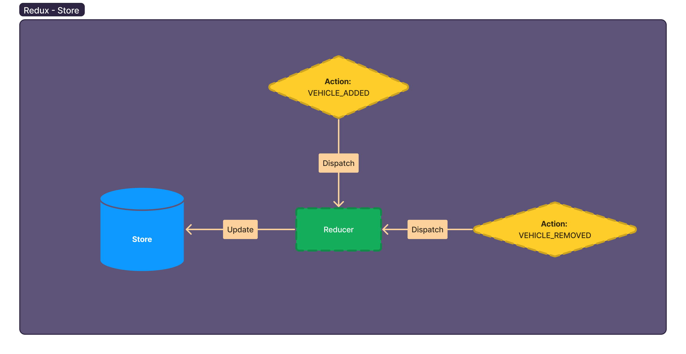

# 3.3 🤷‍♂️ A reducer responds to the action and calculated the next state



```javascript
import { configureStore } from "@reduxjs/toolkit";

function vehiclesReducer(state = [], action) {
	switch(action.type) {
		case "VEHICLE_ADDED":
			return [...state, action.payload];
	    default:
			return state
	}
}

const store = configureStore({
	reducer: vehiclesReducer
});

store.dispatch({ 
	type: "VEHICLE_ADDED",
	payload: { id: 1, name: "Vehicle 1" }
})
```


### Resources

**Next:** [3.4.Reducers-can-be-composed](3.4.Reducers-can-be-composed.md)
**Back:** [3.2.Actions-change-state](3.2.Actions-change-state.md)