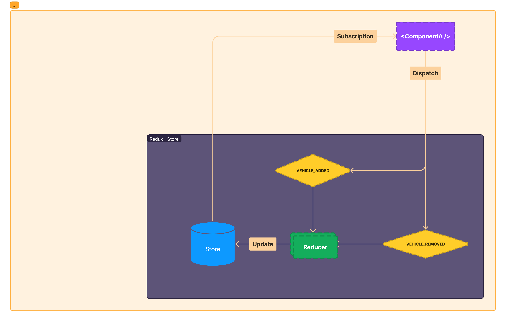

# 3.6 🤷‍♂️ Dispatch actions to alter the state



```jsx
import { Provider, useSelector, useDispatch } from "react-redux";
import { configureStore } from "@reduxjs/toolkit";

// Other code left our for the sake of the example.
const store = configureStore(/*...*/);

function App() {
	return (
		<Provider store={store}>
			<VehicleCount />
			<AddNewVehicle />
		</Provider>
	)
}

function VehicleCount() {
	// This will cause the component to re-render when vehicles.length changes
	const vehicleCount = useSelector(state => state.vehicles.length);
	return (
		<div>Vehicles in application: {vehicleCount}</div>
	);
}

function AddNewVehicle() {
	const dispatch = useDispatch();
	const handleAddNewVehicle = () => 
		dispatch({
			type: "VEHICLE_ADDED",
			payload: { id: 2, name: "Vehicle 2" },
		});
		
	return (
		<button onClick={handleAddNewVehicle}>
			Add new vehicle
		</button>
	)
}
```


## Resources

**Next:** [3.7.Really-more](3.7.Really-more.md)
**Back:** [3.5.Component-subscribe-to-get-state](3.5.Component-subscribe-to-get-state.md)