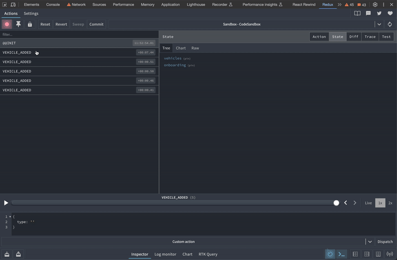

# 4.3 ✅ State changes are traceable

Redux Devtools is a fantastic tool, use it! 

It makes developing with Redux much easier and gives you full traceability of what happened, in what order, what data was passed etc. 

### Resources

**Next**:[4.4.Reduced-coupling](4.4.Reduced-coupling.md)
**Back:** [4.2.Easy-to-test](4.2.Easy-to-test.md)